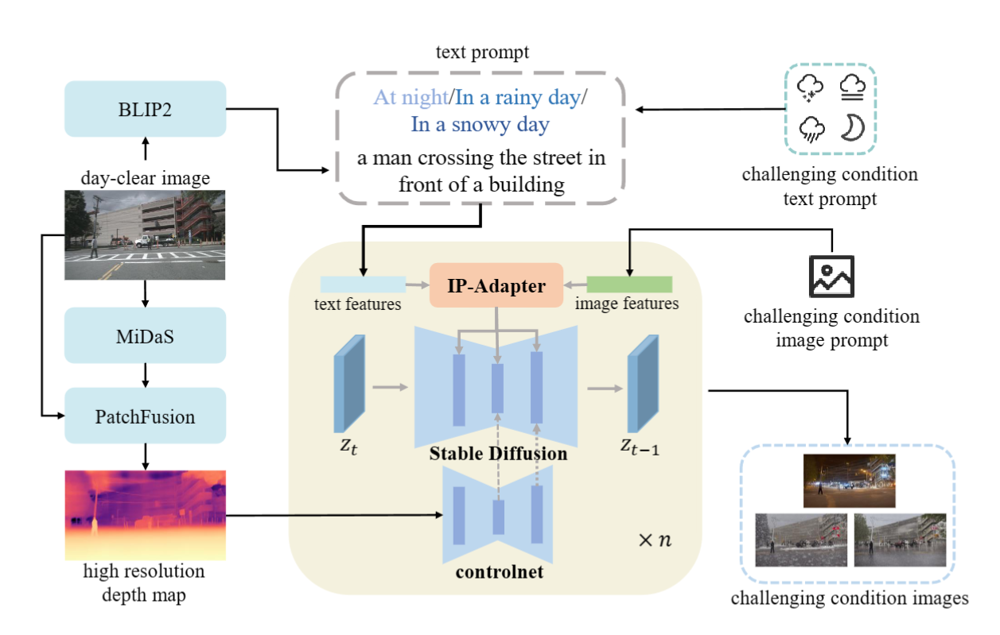
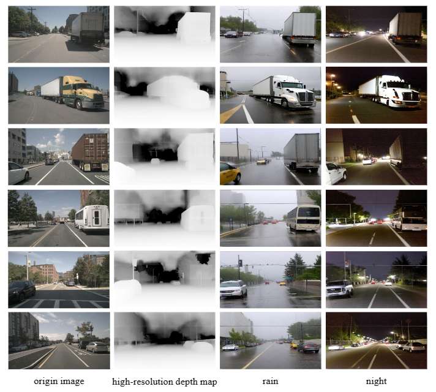
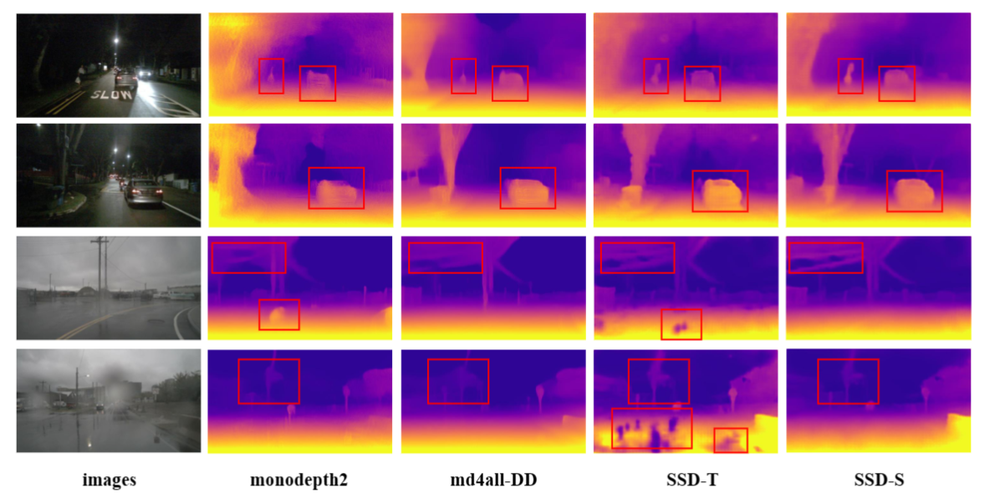
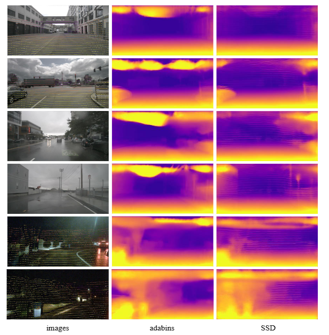

# Stealing Stable Diffusion Prior for Robust Monocular Depth Estimation

[**Paper**](https://arxiv.org/abs/2403.05056) | [**Project Page**](https://github.com/hitcslj/SSD)

Official implementation of SSD: Stealing Stable Diffusion Prior for Robust Monocular Depth Estimation

Yifan Mao, [Jian Liu](https://hitcslj.github.io/), Xianming Liu

<p align="center"> All Code will be released soon... 🏗️ 🚧 🔨</p>


Abstract: *Monocular depth estimation is a crucial task in computer vision. While existing methods have shown impressive results under standard conditions, they often face challenges in reliably performing in scenarios such as low-light or rainy conditions due to the absence of diverse training data. This paper introduces a novel approach named Stealing Stable Diffusion (**SSD**) prior for robust monocular depth estimation. The approach addresses this limitation by utilizing stable diffusion to generate synthetic images that mimic challenging conditions. Additionally, a self-training mechanism is introduced to enhance the model's depth estimation capability in such challenging environments. To enhance the utilization of the stable diffusion prior further, the DINOv2 encoder is integrated into the depth model architecture, enabling the model to leverage rich semantic priors and improve its scene understanding. Furthermore, a teacher loss is introduced to guide the student models in acquiring meaningful knowledge independently, thus reducing their dependency on the teacher models. The effectiveness of the approach is evaluated on nuScenes and Oxford RobotCar, two challenging public datasets, with the results showing the efficacy of the method.*


<div align=center>

</div>


## Generative diffusion-model based translation
GDT translated images in nuScenes.

<!-- <div align=center>

</div> -->

<div align=center>

</div>


## Self-supervised depth estimation results

<div align=center>

</div>

## Supervised depth estimation results

<div align=center>

</div>

## BibTeX

```bibtex
@article{mao2024stealing,
  title={Stealing Stable Diffusion Prior for Robust Monocular Depth Estimation},
  author={Mao, Yifan and Liu, Jian and Liu, Xianming},
  journal={arXiv preprint arXiv:2403.05056},
  year={2024}
}
```